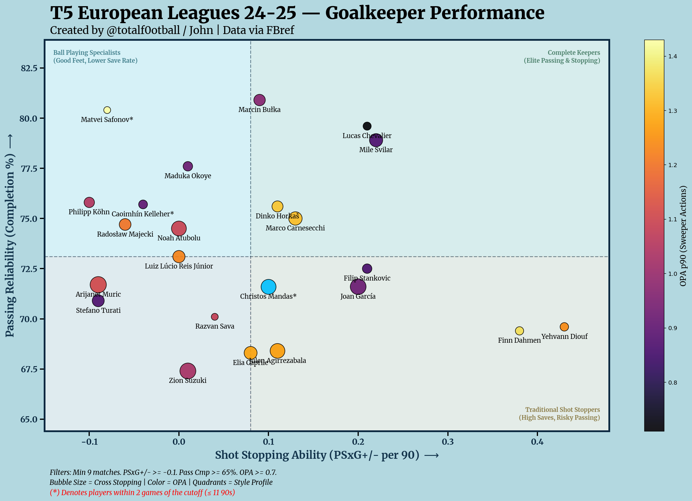
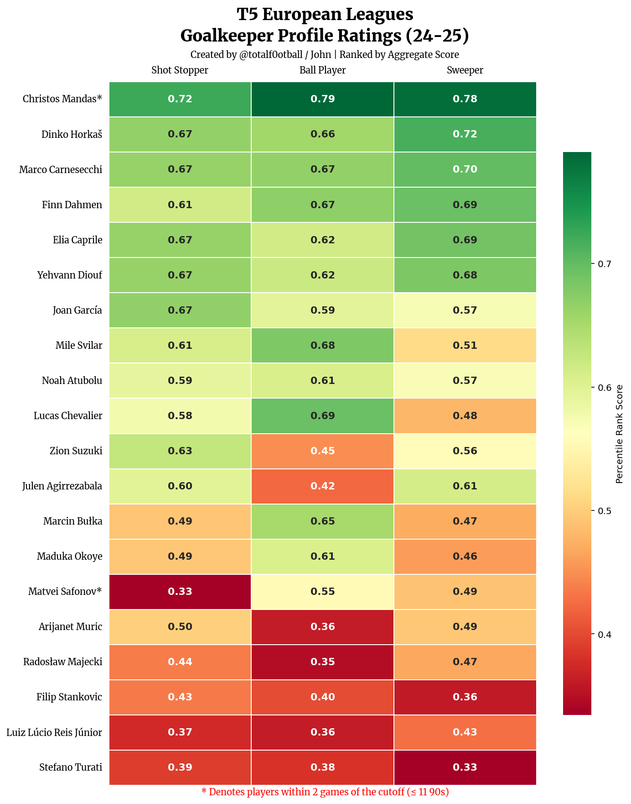

# 🧤 Goalkeeper Performance Analysis & Profiling

A Python analytics suite that evaluates football goalkeepers based on Shot Stopping, Distribution, and Sweeping actions. It generates high-quality visualizations to identify elite performers and distinct playstyles.

## 📂 Project Structure
* `Data/`: Contains the dataset (FBref 2024-2025).
* `Output/`: Contains sample visualizations generated by the script.
* `main.py`: The core analysis script.

## 📊 Sample Output

### 1. Performance Matrix
A quadrant analysis comparing Shot Stopping (PSxG+/-) vs. Passing Reliability. Includes "Smart Labels" to avoid clutter and storytelling annotations to define player roles (e.g., "Complete Keeper" vs. "Traditional Shot Stopper").



### 2. Profile Heatmap
A ranked leaderboard of the top 20 goalkeepers, graded on three specific roles:
* **Shot Stopper:** Reflexes and pure saving ability.
* **Ball Player:** Passing range and accuracy.
* **Sweeper:** Defensive actions outside the penalty area.



## 🚀 Setup & Usage

### 1. Installation
Clone the repo and install the required libraries:
```bash
pip install -r requirements.txt
